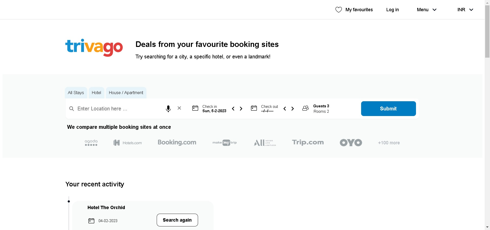
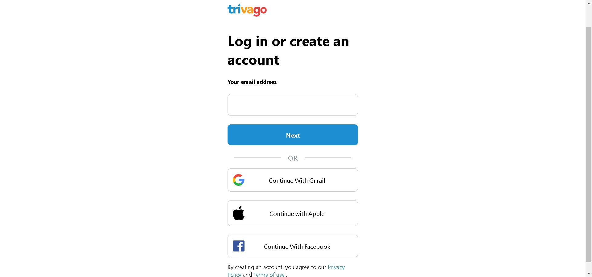
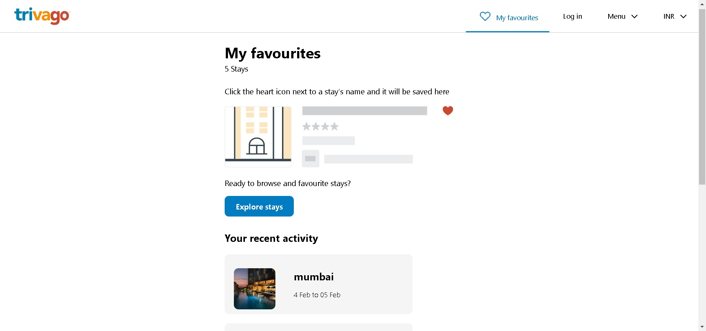
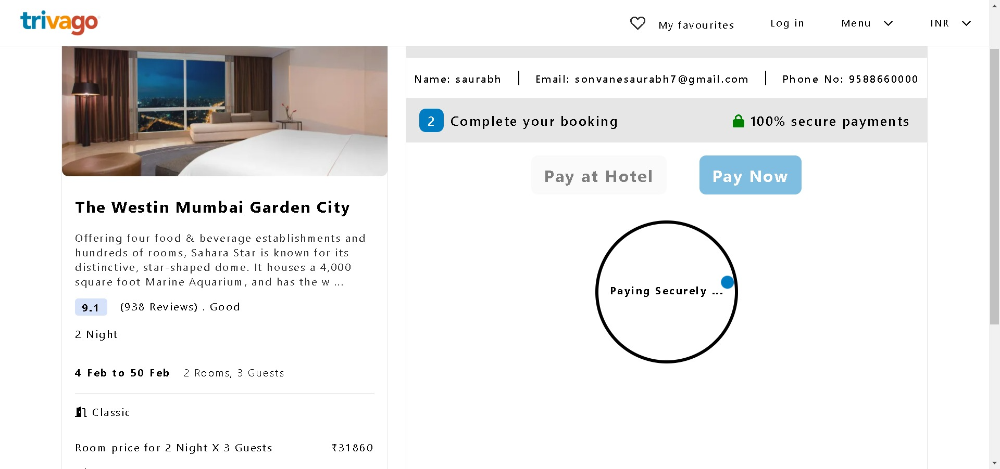
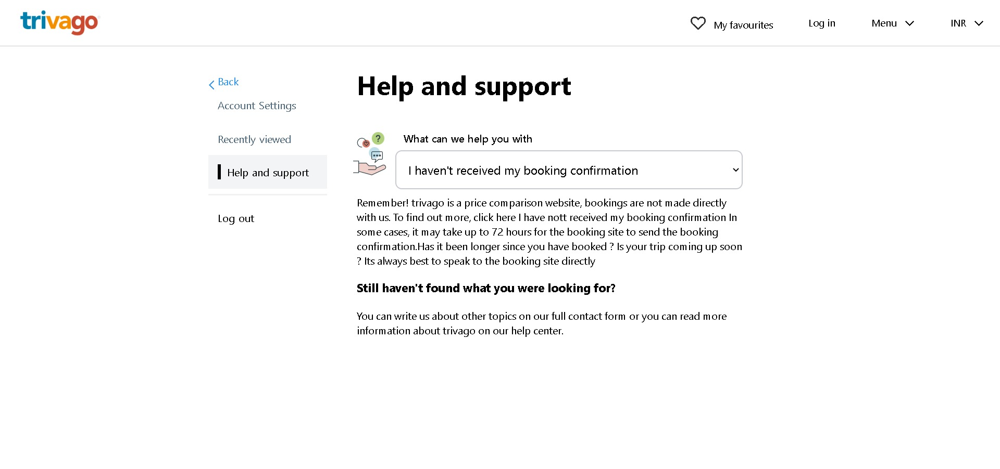
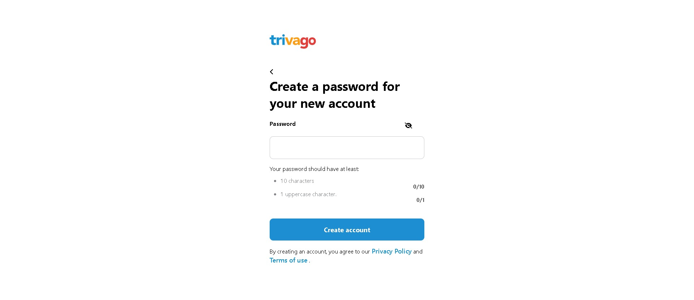

# **TRIVAGO-CLONE**

## **Project Description**

The goal of TRIVAGO-CLONE was to create a replica of trivago.com that functions similarly to the original website.  This includes the ability to browse hotels based on location, create an account, setting user preferences like check-in and check-out date , booking hotels as well as paying online. The project was developed using only HTML, CSS, and JavaScript.

## **Tech stacks used :**
To create this clone following Tech stack is used by contributors.  
 

   

* **Document Object Model (DOM)**
* **SMTP API and Elastic Email**
* **FlatIcons**
* **FontAwesome**

# **Project Status**

TRIVAGO-CLONE is now complete and fully functional. The team has successfully implemented all of the necessary features and functionality of the website.

## About Trivago

Founded in 2005 by three university friends in Düsseldorf (Germany), trivago has since become a leading global accommodation search website, focused on reshaping the way millions of travelers search for and compare hotels and other accommodations.

## Interface Overview

#### **Landing Page**

 

#### **Responsive Landing Page**

 

#### **Login Page**

 

#### **Getting otp by email Page**

 

#### **Hotel Booking Page**

 

#### **Favourites Page**

 

#### **Payment Page**

#### **Help and support Page**

 

#### **Account Setting Page**

 

#### **Create Account Page**

 

## See Live
Visit the Deployed version using this <a href="https://trivago-cloned.netlify.app/">link</a>  

## Team Members and Contributors

### Saurabh Sonvane
- Github : s17200
- Visit Github : https://github.com/s17200
- Check out Linkedin : http://linkedin.com/in/saurabh-sonvane-64106017b

### Arun Shaw
- Github : Arun-ez
- Visit Github : https://github.com/Arun-ez
- Check out Linkedin : https://www.linkedin.com/mwlite/in/arun-shaw-60ba64240

### Versha Kumari
- Github : VershaKumari264
- Visit Github : https://github.com/VershaKumari264
- Check out Linkedin : https://www.linkedin.com/in/versha-kumari-87206a20a/

### Akash Saha
- Github : AkashSaha747
- Visit Github : https://github.com/AkashSaha747
- Check out Linkedin : https://www.linkedin.com/in/akash-saha-669a0a1a2/

### Pradeep Tripathi
- Github : coolcoderpradeep
- Visit Github : https://github.com/coolcoderpradeep
- Check out Linkedin : https://www.linkedin.com/in/pradeep-kumar-tripathi-a3345a248

